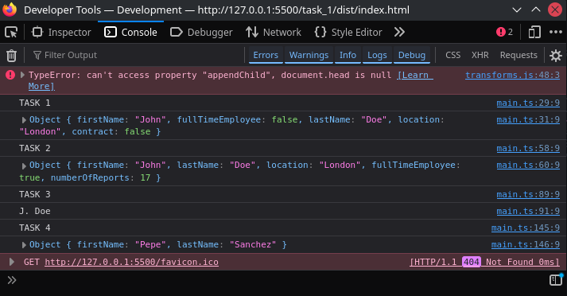

<p align="right">
  <a href="https://holbertonschool.uy/" target="_blank" style="border:0;">
    
  </a>
</p>

# Holberton - Web React
TypeScript concepts: types, interfaces, classes, functions, DOM handling, generics, namespaces, declaration merging, and basic nominal typing.

## Index

- [Holberton - Web React](#holberton---web-react)
  - [Index](#index)
    - [Project Notes](#project-notes)
    - [Resources](#resources)
    - [Webpack](#webpack)
      - [Webpack tutorial 👈👈](#webpack-tutorial-)
      - [Note!](#note)
    - [TypeScript checker](#typescript-checker)
  - [Tasks](#tasks)
    - [Task 1: Let's build a Teacher interface, Extending the Teacher class,  Writing a class.](#task-1-lets-build-a-teacher-interface-extending-the-teacher-class--writing-a-class)
    - [Task 5: Advanced types Part 1](#task-5-advanced-types-part-1)


### Project Notes

For this project I'll use the recommended webpack directory structure:

```text
task_#/
├── dist/
│   ├── bundle.js
│   └── index.html
├── js/
│   └── main.ts
├── .eslintrc.js
├── package.json
├── tsconfig.json
└── webpack.config.js
```

### Resources
- [TypeScript Handbook](https://www.typescriptlang.org/docs/handbook/) — Official TypeScript guide.
- [tsconfig Reference](https://www.typescriptlang.org/tsconfig) — tsconfig.json options.
- [ts-loader (webpack)](https://github.com/TypeStrong/ts-loader) — TypeScript loader for Webpack.
- [Webpack Official Docs](https://webpack.js.org/concepts/) — Bundler concepts and configuration.
- [webpack-cli](https://github.com/webpack/webpack-cli) — CLI for running webpack.
- [webpack-dev-server / webpack serve](https://webpack.js.org/configuration/dev-server/) — Dev server and hot reloading.
- [html-webpack-plugin](https://github.com/jantimon/html-webpack-plugin) — Injects bundles into index.html.
- [ESLint](https://eslint.org/docs/latest/user-guide/getting-started) — Linting guide for JS/TS.
- [MDN — DOM](https://developer.mozilla.org/en-US/docs/Web/API/Document_Object_Model) — DOM APIs reference.
- [The Odin Project — Webpack tutorial](https://www.theodinproject.com/lessons/javascript-webpack) — Practical guide.

### Webpack

I've already worked with webpack, check it out, it's very detailed and guided :D
#### [Webpack tutorial](https://github.com/glovek08/The_Odin_Project-Tutorials/tree/main/webpack-practice) 👈👈

#### <i>Note!</i>

Modify the provided webpack config to enable more verbose `ForkTsCheckerWebpackPlugin`:
```js
// ... Existing code
new ForkTsCheckerWebpackPlugin({
  async: false,
  typescript: {
    diagnosticOptions: { semantic: true, syntactic: true }
  }
}), // Existing code...
```
Also the provided config compiles `node_modules`, exclude it:
```js
 module: {
    rules: [
      {
        test: /\.tsx?$/,
        loader: 'ts-loader',
        options: {
          transpileOnly: true
        },
        exclude: /node_modules/ // add this
      }
    ]
  },
```
* Normally you'd run webpack with `npx` but for this task run with `npm`:
```bash
$ npm run build
```
* Run webpack server
```bash
$ npm run start-dev
```

* `npm run build`:
  Runs the "build" script from package.json. Example: if package.json has "build": "webpack", npm runs that exact command.
  Adds node_modules/.bin to PATH, exposes npm lifecycle env vars (npm_lifecycle_event, etc.), and runs any prebuild/postbuild scripts.
  Safe, reproducible for project-level workflows and CI.

*  `npx webpack`:
  Runs the webpack binary directly. npx prefers the local node_modules/.bin/webpack; if not found, it can fetch a package temporarily from the registry.
  Good for ad-hoc invocation or when you don’t want/need a package.json script.
  Example: npx webpack --config webpack.config.js
  
* Use npx for direct testing or if you need to run a specific webpack CLI commmand with extra verbosity:
```bash
$ npx webpack --config webpack.config.js --stats-error-details
```

* Run Jest tests:
```bash
$ npm run test
```

### TypeScript checker

Run the TypeScript checker:
```bash
$ npx tsc --noEmit
```


## Tasks
### Task 1: Let's build a Teacher interface, Extending the Teacher class,  Writing a class.

<i>*Ignore the warnings</i>

### Task 5: Advanced types Part 1

For this task I've used `type` to define a complex type:
```ts
type HumanWorker = Teacher | Director;
type Salary = number | string;
```
Which then is passed to the type checker:
```ts
const createEmployee = (salary: Salary): HumanWorker => {
  return typeof salary === "number" && salary < 500 
      ? new Teacher()
      : new Director();
}
```
Also to extend some of the debugging logs, I've used `assert` to test with Node.js, since assert doesn't work in the browser, I've also used a <a href="https://developer.mozilla.org/en-US/docs/Glossary/Polyfill"><strong>polyfill</strong></a> to overwrite `assert.StrictEqual`:

```ts
const assert = {
  strictEqual(actual: any, expected: any, message?: string) {
    if (actual !== expected) {
      throw new Error(message || `Assertion failed: ${actual} !== ${expected}`);
    }
  }
};
```